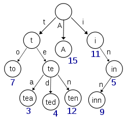

# Trie (前缀树或字典树)

在计算机科学中，trie，又称前缀树或字典树，是一种有序树，用于保存关联数组，其中的键通常是字符串。与二叉查找树不同，键不是直接保存在节点中，而是由节点在树中的位置决定。一个节点的所有子孙都有相同的前缀，也就是这个节点对应的字符串，而根节点对应空字符串。一般情况下，不是所有的节点都有对应的值，只有叶子节点和部分内部节点所对应的键才有相关的值。

Trie这个术语来自于retrieval。根据词源学，trie的发明者Edward Fredkin把它读作英语发音：/ˈtriː/ "tree"。[1][2]但是，其他作者把它读作英语发音：/ˈtraɪ/ "try"。[1][2][3]

在图示中，键标注在节点中，值标注在节点之下。每一个完整的英文单词对应一个特定的整数。Trie可以看作是一个确定有限状态自动机，尽管边上的符号一般是隐含在分支的顺序中的。

键不需要被显式地保存在节点中。图示中标注出完整的单词，只是为了演示trie的原理。

trie中的键通常是字符串，但也可以是其它的结构。trie的算法可以很容易地修改为处理其它结构的有序序列，比如一串数字或者形状的排列。比如，bitwise trie中的键是一串位元，可以用于表示整数或者内存地址。

# Trie结构

      |
      a --------- e ----- r
      |           |       |
      m --- n     m       o
      |     |     |       |
      y     n     m       b ----- g
      |     |     |       |       |
    \0 56 \0 15   a     \0 27     e
                  |               |
                \0 30             r
                                  |
                                \0 52

----

